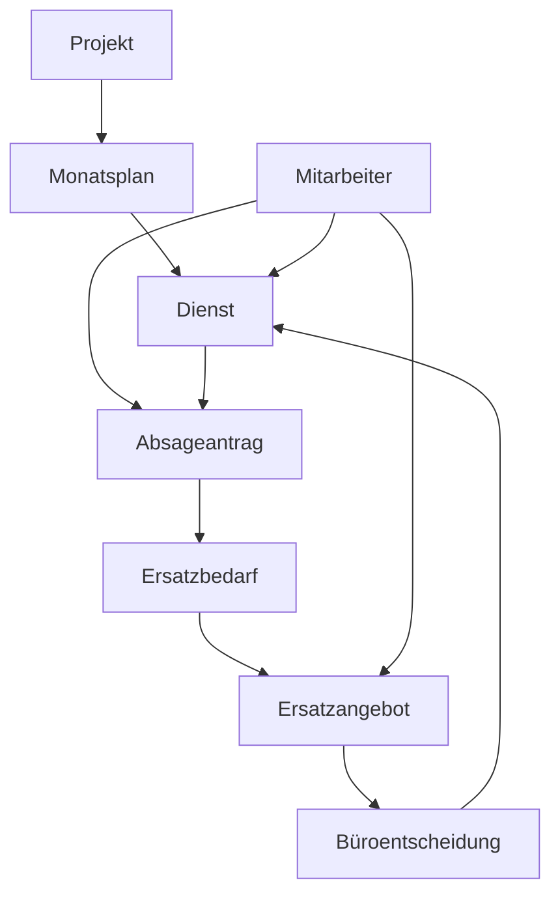

# SecurePlan – fachlicher Domain-Überblick

Ein Projekt besitzt Monatspläne. Ein Monatsplan enthält Dienste; Mitarbeiter werden diesen Diensten zugeordnet. Absageanträge und Ersatzangebote bilden den fachlichen Workflow zur Änderung einer Besetzung.

Diese Übersicht beschreibt fachliche Beziehungen. Sie ist kein physisches Datenbankschema und definiert keine technischen Tabellenfelder oder Implementierungsdetails.
